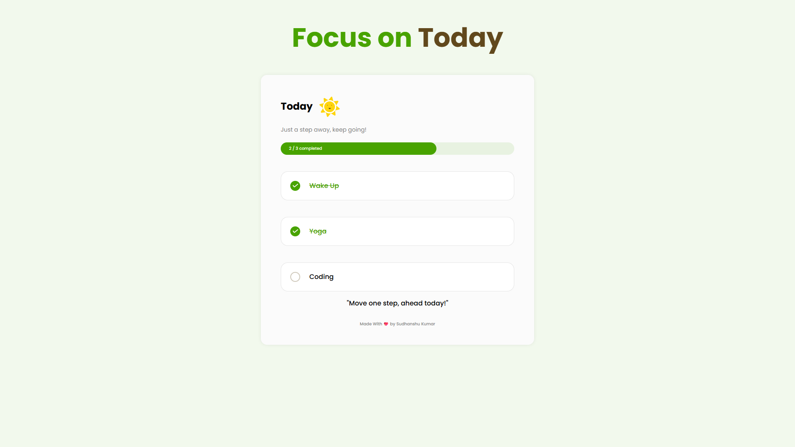

# focus-on-today
This is a simple a website where you can add your present day task and after complete that task you can remove it.
# 🎯 Focus on Today – Daily Goals Tracker

**Focus on Today** is a minimal and elegant **daily goal tracking web app** designed to help you stay focused, productive, and motivated. You can set 3 goals each day, track their completion visually, and your progress is automatically saved using **localStorage**, so your goals remain even after reloading or closing the browser.

---

## 🔗 Live Preview

[Click Here to View](https://your-live-preview-link.com)

## 📸 Preview



## 📌 What is This Project?

This is a simple front-end project built using:

- ✅ **HTML** – to structure the content.
- 🎨 **CSS** – to style and create responsive layouts.
- ⚙️ **JavaScript** – to handle interactivity, user input, and data storage via `localStorage` in browser.

The main idea is to help users **focus on just 3 goals per day**, complete them one by one, and visually track their success with a **progress bar** and **motivational messages**.

---

## 🧠 Key Features

- 🖊️ Add and edit **3 daily goals**
- ☑️ Tick off completed goals using a custom checkbox
- 📈 Dynamic **progress bar** that updates in real-time
- 💡 **Motivational quotes** based on how many goals are completed
- 💾 **Data persistence** using browser's `localStorage`
- 🧼 Simple and clean user interface
- 📱 **Responsive design** for all screen sizes

---

## 🗂️ Folder Structure
```js
project-root/
│
├── index.html # Main HTML structure
├── style.css # CSS for layout and responsiveness
├── script.js # JavaScript logic and localStorage
├── assets/ # Icons and images
│ ├── Sun.svg
│ └── tick.svg
└── README.md # Project documentation
```
---

## 🔧 How to Use the App

### 1. Open the App

- Download or clone the repository
- Open `index.html` in your preferred browser

### 2. Set Your Goals

- Enter your 3 goals in the input fields.
- The placeholder says: **"Add new goal..."**

### 3. Track Progress

- Click the circular checkbox to mark a goal as completed.
- Progress bar updates visually.
- Motivational quote changes based on your progress.

### 4. Done for the Day!

- When all 3 goals are completed, the app celebrates with an encouraging message.
- Your data stays saved, even if you close the tab or refresh.

---

## 💾 Use of `localStorage`

### ✅ Why Use `localStorage`?

The app uses **localStorage** to ensure your goals and progress are saved **without needing a server** or a database.

### 🔍 How It's Used

In the `script.js` file, data is saved and retrieved like this:

#### 🧠 Initialization

```javascript
const allGoals = JSON.parse(localStorage.getItem('allGoals')) || {
  first: { name: '', completed: false },
  second: { name: '', completed: false },
  third: { name: '', completed: false }
};
```

- If nothing is saved yet, it starts with blank goals.
- If saved data exists, it restores it from localStorage.

### 💾 Saving Goals
When you type or complete a goal:
```js

allGoals[input.id].name = input.value;
localStorage.setItem('allGoals', JSON.stringify(allGoals));
```

- The input field updates the allGoals object.
- The object is converted to a JSON string and stored in the browser.

### 🔁 Auto Load on Refresh
On page load, inputs and checkboxes are automatically filled:

```js
input.value = allGoals[input.id].name;
if (allGoals[input.id].completed) {
  input.parentElement.classList.add('completed');
}
```

This ensures your progress is never lost unless you manually clear your browser data.

### 🧪 Example Use Case
Imagine it's morning. You open the app and type:

    1. "Finish DSA assignment"

    2. "Practice 1 hour C++"

    3. "Watch PHP tutorial"

As you complete each task, you check it off and see:

    - The progress bar filling
    - Your goals turning green
    - A motivational message cheering you on

Everything is auto-saved, so if you revisit after lunch, your goals are still there!


## 📱 Responsive Design

- Adjusts layout, font size, and spacing for mobile screens.
- Ensures you can track goals from your phone or tablet easily.


## 📄 License
- This project is open-source and licensed under the MIT License.
- Feel free to use, modify, or contribute!


## 🙋‍♂️ Author
**Sudhanshu Kumar**

👨‍💻 Passionate about Programming & Web Dev
